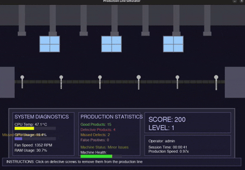
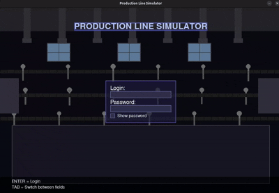

That project is a product line simulator game. The goal is to detect defected screws. 

If user would skip too many of them, then the fire would start (user can stop it but if no, then a big boom is comming).

From time to time is also checked operator's presence, and if they wouldnt press expected key, then they would be logged out.

To use system operator should log into the system providing login and password (saved in simple json database).

The program is getting system parameters using `psutil` library. Then based on operator's work add random values to them (as we cannot directly modify system parameters so we randomize them based on user's decisions). If system gets too hot then it would make more damaged screws. If operaator skip too many defected screws they it would damage the system, and so on.
